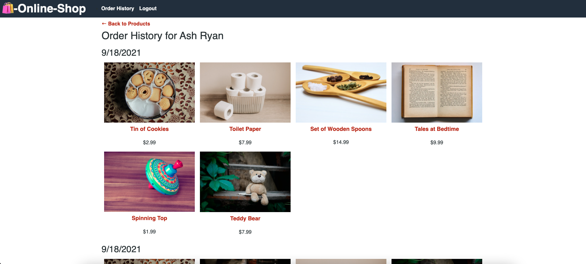
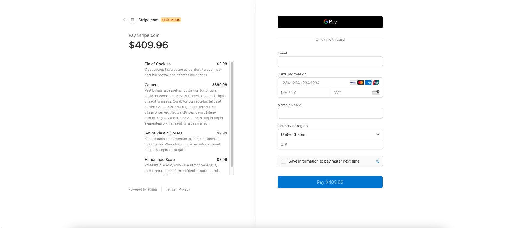

# Online Retail Shop

## Description
A React e-commerce demo that has been reconfigured to use Redux for state management

## Table of Contents

- [Built With](#built-with)
- [See it for yourself](#screen-shots)
- [User Story](#user-story)
- [Acceptance Criteria](#acceptance-criteri)
- [Contact](#contact)
- [Links](#links)

## Built With

- ### 
  - 
  - 
  - 
  - 
- 
- 
- 
- 
- 
- 
- 


## Screen Shots
Homepage

Order History

Stripe Checkout Page


## User Story
```
AS a senior engineer working on an e-commerce platform
I WANT my platform to use Redux to manage global state instead of the Context API
SO THAT my website's state management is taken out of the React ecosystem
```

## Acceptance Criteria
```
GIVEN an e-commerce platform that uses Redux to manage global state
WHEN I review the app’s store
THEN I find that the app uses a Redux store instead of the Context API
WHEN I review the way the React front end accesses the store
THEN I find that the app uses a Redux provider
WHEN I review the way the app determines changes to its global state
THEN I find that the app passes reducers to a Redux store instead of using the Context API
WHEN I review the way the app extracts state data from the store
THEN I find that the app uses Redux instead of the Context API
WHEN I review the way the app dispatches actions
THEN I find that the app uses Redux instead of the Context API
```

## Contact

* Connect with me on [LinkedIn]()
* Send me a message at [ash.ryan125@gmail.com](mailto:ash.ryan125@gmail.com)
* Checkout my [Github profile](https://github.com/ashryan125/) to see what I've been working on


## Links

* [Deployed App](https://ecommerce-demo-redux.herokuapp.com/)
* [GitHub Repo](https://github.com/ashryan125/redux-refactor)
* [My Portfolio](https://ashryan125.github.io/full-stack-portfolio/)


